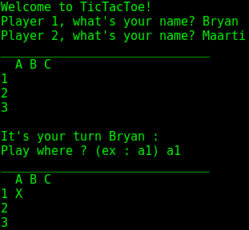
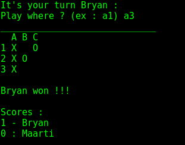

# TicTacToe

Simple TicTacToe game in command-line or GUI.
I did this to practise my C, not to be rusty.

## Overview

### Command Line




### Graphical

*not yet*

## Getting started

### Compiling

```bash
gcc -o tictactoe tictactoe.c
```

### Running in Command Line
```bash
./tictactoe cli
```

### Running in Graphical
```bash
./tictactoe gui
```
